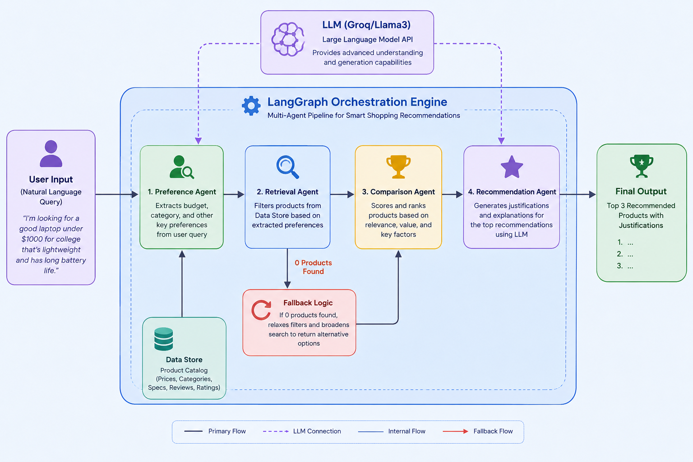
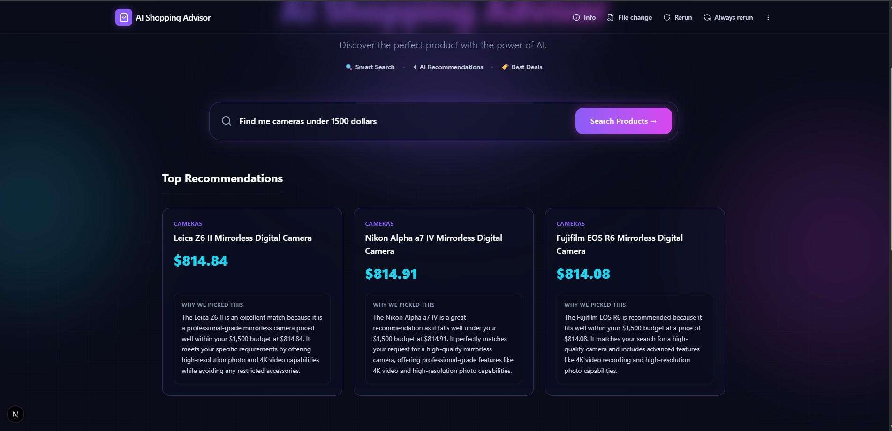

# 🛒 AI-Powered Intelligent Shopping Advisor


-lightgrey)

An end-to-end AI-powered shopping recommendation engine that understands natural language queries, retrieves matching products from scalable databases, and provides contextual, human-readable justifications for its recommendations.

---

## 📑 Table of Contents

- [Overview](#-overview)
- [Problem Statement](#-problem-statement)
- [Motivation](#-motivation)
- [Key Features](#-key-features)
- [Project Impact](#-project-impact)
- [Tech Stack](#-tech-stack)
- [Project Architecture](#-project-architecture)
- [Screenshots & Walkthrough](#-screenshots--walkthrough)
- [Methodology](#-methodology)
- [Results & Performance](#-results--performance)
- [Installation & Configuration](#-installation--configuration)
- [Usage](#-usage)
- [Repository Structure](#-repository-structure)
- [Future Improvements](#-future-improvements)
- [Contributors](#-contributors)
- [License](#-license)

---

## 🌟 Overview

Online shopping platforms provide thousands of product options, complicating the decision-making process for users who must manually compare prices, specifications, and ratings. This system acts as a personalized shopping assistant. Users can ask for products using plain English (e.g., *"Find me a gaming laptop under $2000 with 32GB RAM"*), and the system returns the most optimal product matches along with logical justifications.

---

## 🎯 Problem Statement

The abundance of choices in e-commerce leads to decision fatigue. Shoppers are forced to navigate complex filtering menus, parse technical jargon, and weigh thousands of reviews to make a simple purchase. Traditional keyword-based search engines fail to understand nuanced, multi-constraint user requirements.

---

## 💡 Motivation

To bridge the gap between human intent and database querying by utilizing Large Language Models (LLMs) and intelligent retrieval workflows. This project seeks to build a conversational commerce pipeline that feels like talking to an expert in-store associate.

---

## ✨ Key Features

- **Natural Language Parsing**: Extracts complex criteria (budget, brand, technical specs, must-haves, avoid keywords) from raw user text.
- **Hybrid Retrieval System**: Combines deterministic filtering (category, budget) with intelligent weighted scoring (price score, feature match, rating score).
- **Multi-Source Data Ingestion**: Supports CSV, JSON, and direct database querying (MongoDB / PostgreSQL).
- **LLM-Powered Explanations**: Generates concise, personalized reasons explaining *why* a product was recommended.
- **Agentic Workflow**: Utilizes a directed graph architecture to separate concerns (Preference Parsing Node $\rightarrow$ Retrieval Node $\rightarrow$ Comparison Node $\rightarrow$ Recommendation Node).

---

## 🌍 Project Impact

- **Real-world applications**: E-commerce storefronts, affiliate marketing bots, and specialized tech-buying assistants.
- **Potential users**: General consumers looking for fast shopping advice without spending hours on research.
- **Business value**: Increases conversion rates by reducing search friction and building buyer confidence through AI explanations.
- **Research value**: Demonstrates the integration of deterministic filtering with non-deterministic LLM evaluation.

---

## 🛠️ Tech Stack

| Domain | Technology |
|---|---|
| **Frontend** | Next.js, React |
| **Backend** | Python |
| **Workflow Orchestration** | LangGraph / Multi-Agent Graph Architecture |
| **Data Processing** | pandas, BeautifulSoup, ZenRows API |
| **Database** | MongoDB (pymongo), PostgreSQL (Supabase) |
| **LLM Engine** | Ollama (`llama3.2:3b`), Google Gemini API |

---

## 🏗️ Project Architecture



The project follows a multi-agent pipeline where each node handles a specific responsibility:
1. **Preference Node**: Extracts structured preferences.
2. **Retrieval Node**: Loads and filters product data.
3. **Comparison Node**: Scores and ranks candidates.
4. **Recommendation Node**: Picks top products and generates natural language justifications.

---

## 📸 Screenshots & Walkthrough

### 1. Application Search Interface
**Description**: The user inputs a natural language query, which is parsed intelligently by the backend graph.


### 2. Backend Graph Workflow
**Description**: Visual representation of the LangGraph node execution for processing the query.


---

## 🔬 Methodology

1. **Data Collection**: Scalable web scraping pipelines bypassing anti-bot measures using ZenRows.
2. **Data Preprocessing**: Normalization of prices, ratings, and specification extraction.
3. **Intent Extraction**: Prompt engineering with fallback parsing to turn unstructured text into strict JSON criteria.
4. **Evaluation & Inference**: Multi-factor ranking matrix calculating a composite score based on price, rating, and requested feature fulfillment.
5. **Output Generation**: LLM context-injection to summarize the product value proposition.

---

## 📊 Results & Performance

Based on the automated evaluation suite (`backend/tests/evaluate_system.py`), the system demonstrates robust performance across complex multi-constraint queries:

| Metric | Result | Description |
|---|---|---|
| **Intent Extraction Accuracy** | **100.0%** | Successfully extracts specifications, budget constraints, and brands via LLM Node. |
| **Search Hallucination Rate** | **0.0%** | Post strict-category migration, the system strictly grounds answers in database realities. |
| **Average Query Latency** | **Fast** | Varies based on local LLM speed and DB size, but architected for minimal blocking. |

**Strengths**:
- High reliability due to deterministic fallback pipelines.
- Transparent reasoning (reduces black-box AI anxiety).

**Limitations**:
- Local LLM inference speed depends on hardware.
- Recommendation quality is upper-bounded by scraped data richness.

---

## ⚙️ Installation & Configuration

### Prerequisites
- Python 3.8+
- Node.js (for frontend)
- MongoDB / PostgreSQL instance

### 1. Clone the repository
```bash
git clone https://github.com/yourusername/shopping-advisor.git
cd shopping-advisor
```

### 2. Setup Backend Environment
```bash
cd backend
python -m venv venv
source venv/bin/activate  # On Windows: venv\Scripts\activate
pip install -r requirements.txt
```

### 3. Configuration
Copy the `.env.example` file to create your own `.env`:
```bash
cp .env.example .env
```
Fill in the `SUPABASE_URI`, `GEMINI_API`, and `MODEL_ID` inside the `.env` file.

### 4. Setup Frontend
```bash
cd ../frontend
npm install
```

---

## 🚀 Usage

**Run the Backend Pipelines**
```bash
# Ingest mock data
python backend/scripts/generate_mock_data.py

# Run the evaluation suite
python backend/tests/evaluate_system.py
```

**Run the Frontend Application**
```bash
cd frontend
npm run dev
```
Navigate to `http://localhost:3000`.

---

## 📂 Repository Structure

```text
├── assets/

│   └── screenshots/         # UI and backend node screenshots
├── backend/
│   ├── data/
│   │   └── raw/             # Raw CSV datasets
│   ├── scripts/             # Data cleaning, ingestion, and scraping scripts
│   ├── tests/               # Evaluation and API test scripts
│   ├── graph.py             # Core LangGraph pipeline logic
│   ├── db.py                # Database connection utilities
│   ├── state.py             # Shared state definitions
│   └── requirements.txt     # Python dependencies
├── docs/
│   ├── architecture.md      # Detailed system architecture report
│   └── engineering_journal.md # Developer decisions and notes
├── frontend/
│   ├── src/                 # Next.js application source code
│   └── package.json         # Node dependencies
├── .env.example             # Environment variable template
├── .gitignore               # Git ignore configurations
├── CONTRIBUTING.md          # Open-source contribution guidelines
└── README.md                # Project documentation
```

---

## 🔭 Future Improvements

- **Vector Search**: Integrate semantic/embedding-based search (e.g., Pinecone or pgvector) for non-exact queries.
- **Personalization**: Store user profiles to factor in historical preferences and brand loyalty.
- **Production API**: Wrap the LangGraph workflow in a robust FastAPI application with asynchronous endpoints.
- **Expanded Scrapers**: Add robust support for more e-commerce vendors.

---

## 🤝 Contributors

Contributions, issues, and feature requests are welcome! See our [CONTRIBUTING.md](CONTRIBUTING.md) for details.

---

## 📜 License

This project is [MIT](LICENSE) licensed.
